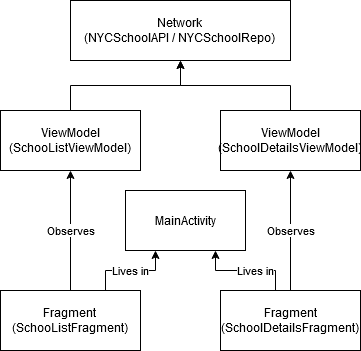

## README

## About
This repository contains a simple, single activity two fragment native MVVM Android application
written in both Kotlin and Java.
The first fragment contains a list of NYC Schools
The second fragment gives more detailed information on the school you select from the list.
This application is powered by the [NYC Open Data API](https://opendata.cityofnewyork.us/) as well
as the [Google Places API](https://developers.google.com/maps/documentation/places/web-service/overview) if enabled

## Steps to run
1. Clone repository
2. Open in Android Studio
3. (Optional) If you'd like images, open app/build.gradle
    - Set the 'PLACES_API_ENABLED' build config to true
    - Open keystore.properties and provide a Google Places API Key
5. To view more traditional implementation (RecyclerView) you can also set 'COMPOSE_VIEW' to false in the build config.
4. Run the project.

### Libraries / Dependencies used
* Retrofit - Network calls (https://square.github.io/retrofit/)
* RxJava - Reactive functionality (http://reactivex.io/) or (https://github.com/ReactiveX/RxJava)
* Chuck - HTTP inspection (debugging) (https://github.com/jgilfelt/chuck)
* Glide - Image loading (https://github.com/bumptech/glide)
* Dagger - Dependency injection (https://github.com/google/dagger)
* Stetho - More debugging (https://github.com/facebook/stetho)
* ktlint - Linting / code quality (https://ktlint.github.io/)
* Landscapist - For loading images with Jetpack Compose (https://github.com/skydoves/landscapist)
* Coroutines
* Compose
* Image Icons / Assets came from https://material.io/resources/icons/

### APIs
* Google Places -https://cloud.google.com/maps-platform/places
* NYC Open Data API - https://opendata.cityofnewyork.us/

### 2022 Update
* Updates original list view to display the image better
* Migrates some rxjava network calls to using coroutines
* Migrated the google places API call to a repo rather than doing directly in the adapter
* Added a flag and rebuilt the school list in compose behind that flag
* Added some unit and instrumentation tests
* Migrated more java code to Kotlin and updated dependencies

### Future improvements list
- Write more unit and instrumentation testing especially around jetpack compose.
- Implement simple caching for offline usage.

### GIFs

| With RecyclerView (`COMPOSE_VIEW = false`) | Compose (`COMPOSE_VIEW = true`) |
|------------------------------------------- | --------------------------------|
|  |  |
